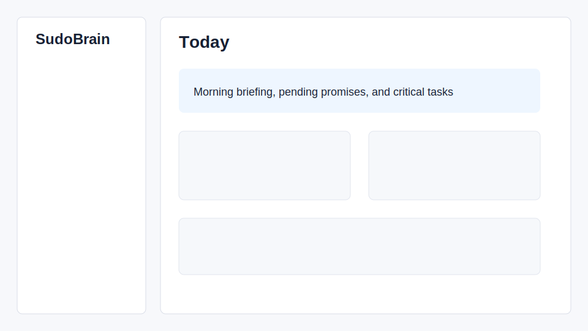
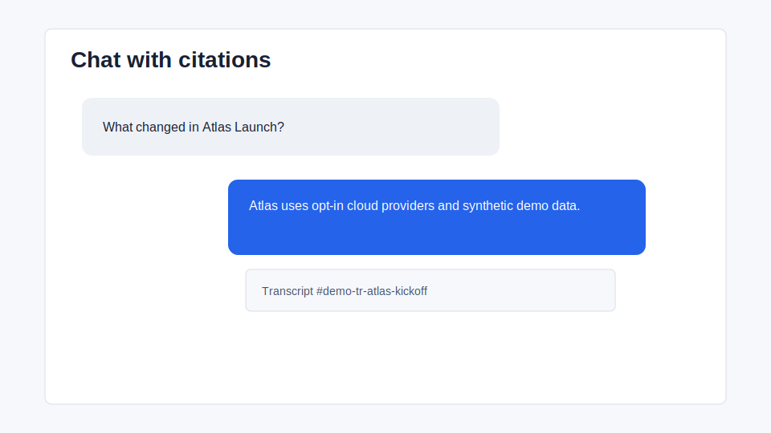
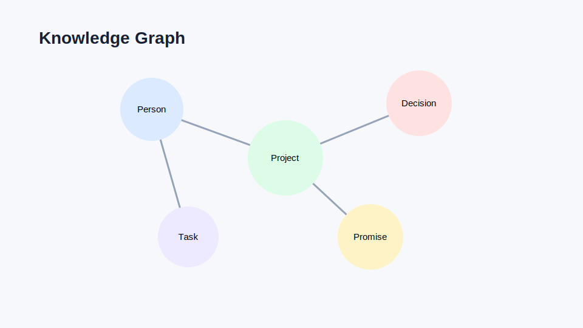
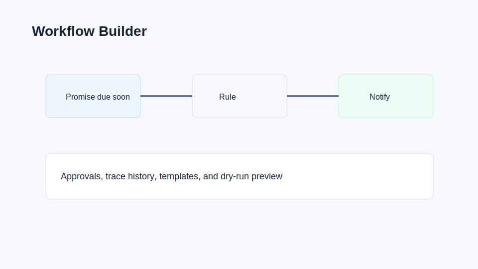
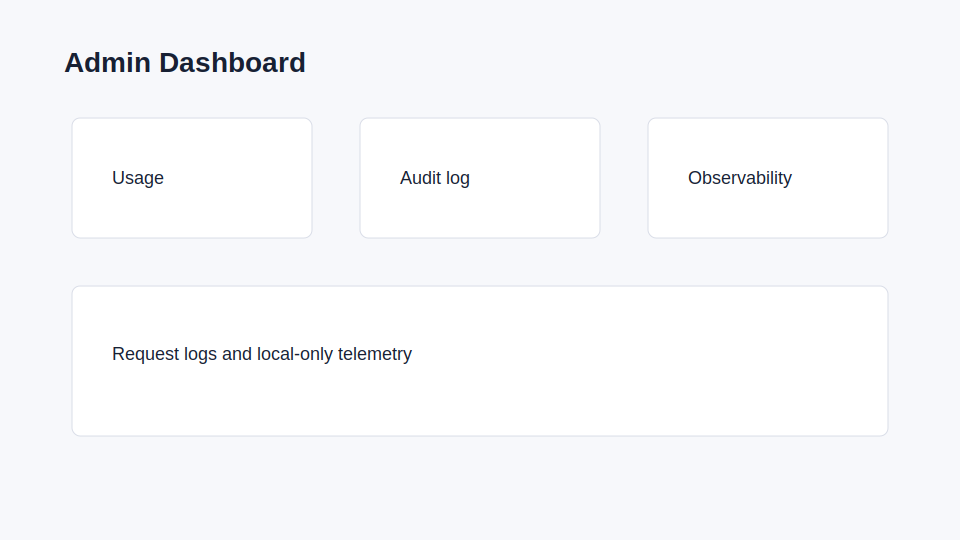

# SudoBrain

SudoBrain is a local-first work knowledge engine. It reads work context from
meetings, recordings, Slack, Gmail, and local repositories, then builds an
auditable knowledge base of actions, decisions, promises, people, projects, and
relationships.

The project is designed for private/local deployment first: external sources are
read-only, raw data stays on your machine or infrastructure, and extracted
knowledge can be audited before it is used for decisions.

## Features

- Meeting and recording ingestion with transcript processing.
- Read-only Slack sync, including optional direct-message filtering.
- Read-only Gmail sync with attachment text extraction.
- Optional local repository context from Git history and README files.
- Structured extraction of actions, decisions, promises, people, and projects.
- Postgres storage plus optional Neo4j relationship graph.
- Source audit endpoints for validation, dedupe, and graph consistency checks.
- macOS SwiftUI app and browser-extension surfaces for local workflows.

## Try SudoBrain In 5 Minutes

The fastest public-safe path uses local services plus synthetic demo data:

```bash
./scripts/bootstrap_local.sh
./run_backend.sh
```

In another terminal:

```bash
make demo
make smoke
```

Then open the macOS app or query the backend:

```bash
curl 'http://127.0.0.1:8420/search?q=Atlas'
curl 'http://127.0.0.1:8420/knowledge/export?format=markdown'
```

No private Slack, Gmail, Fathom, Linear, or Calendar credentials are needed for
the demo workspace.

## Architecture

- `backend/`: FastAPI service, source sync, extraction, storage, graph, and audit logic.
- `app/`: macOS SwiftUI client.
- `browser-extension/`: lightweight capture extension.
- `web-companion/`: local browser/PWA companion for non-Mac read-only access.
- `mockups/`: design prototypes.
- `scripts/`: optional local maintenance helpers.

See [docs/architecture.md](docs/architecture.md) and
[docs/data-flow.md](docs/data-flow.md) for diagrams and system boundaries.

Storage is local by default:

- Postgres stores source copies and extracted knowledge.
- Neo4j stores the relationship graph.
- Optional vector storage can be used for semantic search.
- Recordings, transcripts, OAuth tokens, and generated data are ignored by Git.

## Supported Sources

- Fathom and local recordings
- Slack channels and optional DMs
- Gmail messages and supported attachments
- Local Git repositories
- Linear issues, when configured

All external integrations are read-only in normal sync paths.

## Quick Start

```bash
cp .env.example .env
python3 -m venv .venv
. .venv/bin/activate
pip install -r backend/requirements.txt
docker compose up -d postgres neo4j
uvicorn backend.main:app --host 127.0.0.1 --port 8420 --reload
```

Or run the helper:

```bash
./scripts/bootstrap_local.sh
./run_backend.sh
```

Then check:

```bash
curl http://127.0.0.1:8420/health
curl http://127.0.0.1:8420/graph/status
curl http://127.0.0.1:8420/sync/audit
```

For a containerized backend plus dependencies:

```bash
make docker-full-up
```

The default `.env.example` disables external sync. Enable only the integrations
you want after reading [docs/privacy.md](docs/privacy.md).

## Demo Data

`make demo` loads a synthetic workspace with meetings, Slack-style messages,
Gmail-style messages, people, projects, tasks, decisions, and promises. Demo
rows are prefixed with `demo-` and can be safely reloaded.

## Screenshots

Synthetic public-safe screenshots:

- 
- 
- 
- 
- 

## Trust And Portability

- Chat responses include source metadata when local search can identify it.
- `/knowledge/export?format=json` exports portable structured knowledge.
- `/knowledge/export?format=markdown` exports a reviewable Markdown vault.
- `/sync/audit` checks local storage and graph health without external calls.

## macOS App

The SwiftUI app lives in `app/`. A local backend should be running before using
the app:

```bash
cd app
swift build
```

For Xcode workflows, open or generate the project according to the files in
`app/`.

## Configuration

Important environment variables:

- `SUDOBRAIN_DATA_DIR`: local generated data directory.
- `SUDOBRAIN_LLM_COMMAND`: optional local reasoning CLI command.
- `POSTGRES_*`: Postgres connection.
- `NEO4J_*`: Neo4j connection.
- `SUDOBRAIN_SYNC_SLACK`, `SUDOBRAIN_SYNC_GMAIL`, `SUDOBRAIN_SYNC_FATHOM`: source toggles.
- `SUDOBRAIN_SLACK_INCLUDE_DMS`: include Slack direct-message scopes.
- `SUDOBRAIN_PROJECTS_ROOT`: folder of local Git repositories to scan.
- `SUDOBRAIN_PROJECT_ALIASES_JSON`: configurable project aliases.
- `SUDOBRAIN_PERSON_ALIASES_JSON`: configurable person aliases.
- `SELF_EMAIL`: optional email used for personal analytics.

See [docs/setup.md](docs/setup.md) for full setup and safe config examples.

## Source Audit

`/sync/audit` checks local storage and graph health without calling external
services. It reports validation status, duplicates, ignored scopes, graph
availability, stale graph nodes, and semantic quality issues.

## Verification

Run the same public-safety and build checks used by CI:

```bash
make verify
```

This checks for secrets, sensitive tracked files, private sample text,
read-only integration boundaries, whitespace issues, Python compile health, and
the macOS Swift build.

For a running local backend:

```bash
make smoke
```

## Privacy Status

SudoBrain can process sensitive communication data. Keep it private until you
understand the storage model, retention behavior, and sync toggles. See
[docs/privacy.md](docs/privacy.md).

## Maturity

This project is early and intended for technically comfortable users. The
[feature matrix](docs/feature-matrix.md) separates stable surfaces from
experimental roadmap work, and [docs/roadmap.md](docs/roadmap.md) tracks the
open-source adoption plan.

## License

MIT. See [LICENSE](LICENSE).
