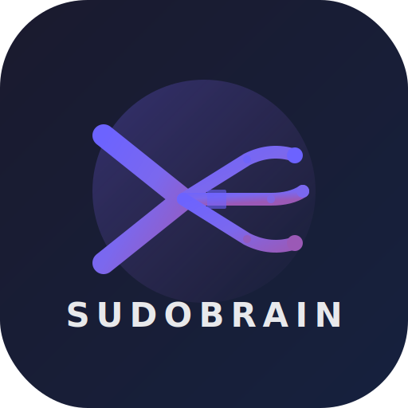
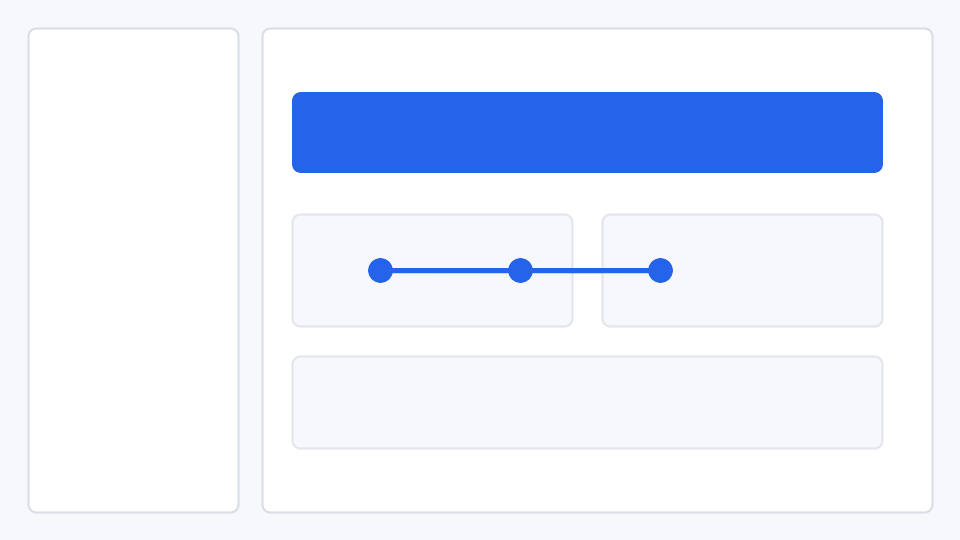

# SudoBrain - Local-First Work Knowledge Engine

<p align="center">
  
</p>

<p align="center">
  <strong>Your private work memory, searchable and auditable.</strong>
</p>

<p align="center">
  <a href=".github/workflows/verify.yml"></a>
  <a href=".github/workflows/docs.yml"></a>
  <a href="LICENSE"></a>
  <a href="VERSION"></a>
</p>

**SudoBrain** is a local-first personal work intelligence system. It reads
meetings, recordings, Slack, Gmail, Linear, local repositories, bookmarks, web
pages, and documents, then builds a reviewable knowledge base of actions,
decisions, promises, people, projects, risks, and relationships.

It is designed for private deployments first. External integrations are
read-only by default, sensitive generated data stays out of Git, and knowledge
can be inspected, exported, audited, and pruned before it drives decisions.

[Setup](docs/setup.md) | [Architecture](docs/architecture.md) | [Data Flow](docs/data-flow.md) | [Privacy](docs/privacy.md) | [Feature Matrix](docs/feature-matrix.md) | [Sources](docs/source-integrations.md) | [MCP](docs/mcp.md) | [Model Providers](docs/model-providers.md) | [Screenshots](docs/screenshots.md) | [Roadmap](docs/roadmap.md)

Preferred setup: run the local bootstrap and demo path first. It creates a safe
workspace with synthetic data, so you can try the product without connecting
Slack, Gmail, Fathom, Linear, Calendar, or private repos.

```bash
./scripts/bootstrap_local.sh
./run_backend.sh
```

In another terminal:

```bash
make demo
make smoke
```

Then open the macOS app or query the backend:

```bash
curl "http://127.0.0.1:8420/search?q=Atlas"
curl "http://127.0.0.1:8420/knowledge/export?format=markdown"
```

## Models And Providers

SudoBrain can work with local and hosted model providers. Keep local models as
the default when privacy matters, then opt in to hosted providers per
environment.

- Local execution: Ollama, LM Studio, and local command providers.
- Hosted providers: OpenAI-compatible APIs, OpenRouter, Anthropic, Gemini,
  Groq, and Bedrock.
- Routing: provider health, test calls, routing rules, route previews, and
  quota/status surfaces are available through the backend and macOS Models UI.

See [docs/model-providers.md](docs/model-providers.md).

## Install

Runtime:

- Python 3.11 or newer.
- Docker for Postgres and Neo4j.
- Swift toolchain for the macOS app.

```bash
cp .env.example .env
python3 -m venv .venv
. .venv/bin/activate
pip install -r backend/requirements.txt
docker compose up -d postgres neo4j
uvicorn backend.main:app --host 127.0.0.1 --port 8420 --reload
```

Or use the helper scripts:

```bash
./scripts/bootstrap_local.sh
./run_backend.sh
```

Containerized backend plus dependencies:

```bash
make docker-full-up
```

## Quick Start

```bash
# Health and graph checks
curl http://127.0.0.1:8420/health
curl http://127.0.0.1:8420/graph/status
curl http://127.0.0.1:8420/sync/audit

# Load public-safe demo data
make demo

# Search and export
curl "http://127.0.0.1:8420/search?q=Atlas"
curl "http://127.0.0.1:8420/knowledge/export?format=json"
curl "http://127.0.0.1:8420/knowledge/export?format=markdown"
```

## From Source

```bash
git clone <repo-url>
cd sudobrain.ai

./scripts/bootstrap_local.sh
./run_backend.sh

cd app
swift build
```

The repository is split into a FastAPI backend, a macOS SwiftUI app, a browser
extension, and a local web companion.

## Security Defaults

SudoBrain processes sensitive communication and work data. Treat all inbound
external content as untrusted input.

Default behavior:

- External sync paths are read-only.
- Slack DMs are excluded unless explicitly enabled.
- Generated transcripts, recordings, tokens, databases, exports, and local
  secrets are ignored by Git.
- Local role-based access control and rate limiting can be enabled for shared
  deployments.
- Secrets can be stored in the encrypted local secrets store.
- Workflow approvals create local approval bundles and outbox records instead
  of silently publishing external writes.

Read [docs/privacy.md](docs/privacy.md) before enabling real sources.

## Highlights

- **Local-first knowledge graph** - actions, decisions, promises, people,
  projects, sources, and relationships with exportable provenance.
- **Meeting and recording ingestion** - transcript processing, extraction, and
  source-aware review.
- **Read-only source sync** - Slack, Gmail, Fathom, Linear, Calendar, local
  repositories, documents, bookmarks, and web pages.
- **Source integration catalog** - GitHub, Notion, Google Drive, Confluence,
  Jira, Asana, Trello, ClickUp, Monday.com, Teams, Zoom, Meet, Outlook, IMAP,
  CRM, support, incident, observability, Figma, read-later, local files,
  terminal activity, and voice/mobile capture contracts.
- **Trust controls** - source freshness, trust reports, retention previews,
  graph explanations, and knowledge provenance endpoints.
- **Chat with citations** - local search context, streaming chat, saved
  sessions, collections, and provider/model selection.
- **Workflow engine** - templates, dry runs, graph previews, approvals, traces,
  replay, and local outbox.
- **Extensibility** - connector SDK, sample intelligence modules, action
  scaffolds, extension previews, plugin registry, and MCP server/client tools.
- **Companion surfaces** - macOS SwiftUI app, browser extension, and PWA-style
  web companion.
- **Admin and observability** - audit log, request log, usage analytics,
  scheduler status, metrics, and release readiness checks.

## Screenshots

Synthetic public-safe screenshots:

- 
- 
- 
- 
- 
- 

## Everything Built So Far

### Core Platform

- FastAPI backend with health, search, chat, sync audit, graph, export,
  provider, workflow, admin, and security APIs.
- Postgres-backed source and knowledge storage with optional Neo4j graph and
  vector search support.
- Demo loader, smoke tests, public repository verifier, release readiness audit,
  and packaging scripts.
- Portable knowledge export to JSON and Markdown vault formats.

### Sources

- Fathom and local recordings.
- Slack channels and optional DMs.
- Gmail messages and supported attachments.
- Linear issues.
- Calendar sources.
- Local Git repositories.
- Documents, bookmarks, webpages, OCR text, and mobile/extension capture.

### Knowledge And Trust

- Actions, decisions, promises, people, projects, tasks, risks, and recurring
  intelligence signals.
- `/knowledge/provenance/{kind}/{item_id}` for source lineage.
- `/sources/freshness` and `/knowledge/trust-report` for stale or low-trust
  knowledge.
- `/graph/export` and `/graph/edge/explain` for relationship inspection.
- `/privacy/retention`, `/privacy/retention/preview`, and `/privacy/sources`
  for privacy controls.

### Chat, Models, And Routing

- Streaming chat endpoint.
- Saved chat sessions and collections.
- Citation cards when local sources are available.
- Provider health, provider test calls, routing rules, route previews, and
  active-provider status in the macOS app.

### Workflows And Agents

- Workflow templates, graph previews, traces, approvals, dry runs, and replay.
- Review queue with filters, accept/dismiss, undo, and approval bundles.
- Scheduled intelligence status, heartbeat trigger, and run-now controls.
- Local approval outbox for external/write actions.

### Extensibility

- Connector SDK interfaces.
- Local Markdown connector example.
- Sample intelligence module.
- Sample workflow action.
- Extension runtime previews.
- Plugin registry.
- MCP server and MCP client preview catalog.

### Apps

- macOS SwiftUI client with Today, Chat, Graph, Source Sync, Models, Workflows,
  Admin, and Settings surfaces.
- Browser extension for capture.
- Web companion for quick capture, search, streaming chat, vault export, report
  export, and workflow builder controls.

### Ops And Release

- Public-safety verifier for secrets, private text, sensitive files, read-only
  integration boundaries, whitespace, Python compile health, and Swift build.
- GitHub Actions workflows for verification, docs build, and release packaging.
- Release manifest, release checklist, changelog, issue templates, labels, and
  community docs.

## How It Works

```text
Meetings / Slack / Gmail / Linear / Calendar / Repos / Docs / Bookmarks / Web
        |
        v
+-----------------------------+
|          SudoBrain          |
|    FastAPI local backend    |
|      127.0.0.1:8420         |
+-------------+---------------+
              |
              +-- Postgres source + knowledge store
              +-- Neo4j relationship graph
              +-- Vector search
              +-- Local/hosted model providers
              +-- macOS app
              +-- Browser extension
              +-- Web companion
              +-- MCP tools
```

## Key Subsystems

- **Source Sync** - read-only ingestion and audit for external systems.
- **Knowledge Extraction** - structured actions, decisions, promises, entities,
  projects, and relationships.
- **Graph** - relationship storage, export, edge explanations, and graph health.
- **Trust Map** - source freshness, provenance, retention, and review signals.
- **Workflow Engine** - templates, dry runs, approvals, traces, and replay.
- **Provider Routing** - local and hosted model configuration with route
  previews and health checks.
- **Admin Surface** - audit log, request log, scheduler controls, metrics, and
  release readiness.
- **MCP And Plugins** - tool discovery, previews, connector interfaces, and
  extension scaffolds.

## Apps

### macOS App

```bash
cd app
swift build
```

The macOS app expects a local backend at `http://127.0.0.1:8420` unless you
configure otherwise.

### Web Companion

Open `web-companion/index.html` against a running backend for browser-based
capture, search, chat, and exports.

### Browser Extension

The extension lives in `browser-extension/`. Load it as an unpacked extension
for local capture flows.

## Configuration

Important environment variables:

- `SUDOBRAIN_DATA_DIR` - local generated data directory.
- `SUDOBRAIN_LLM_COMMAND` - optional local reasoning CLI command.
- `POSTGRES_*` - Postgres connection.
- `NEO4J_*` - Neo4j connection.
- `SUDOBRAIN_SYNC_SLACK`, `SUDOBRAIN_SYNC_GMAIL`, `SUDOBRAIN_SYNC_FATHOM` -
  source toggles.
- `SUDOBRAIN_SLACK_INCLUDE_DMS` - include Slack direct-message scopes.
- `SUDOBRAIN_PROJECTS_ROOT` - folder of local Git repositories to scan.
- `SUDOBRAIN_PROJECT_ALIASES_JSON` - configurable project aliases.
- `SUDOBRAIN_PERSON_ALIASES_JSON` - configurable person aliases.
- `SELF_EMAIL` - optional email used for personal analytics.
- `SUDOBRAIN_RATE_LIMIT_PER_MINUTE` - optional local API rate limit.

See [.env.example](.env.example) and [docs/setup.md](docs/setup.md).

## Verification

Run the same public-safety and build checks used by CI:

```bash
make verify
```

For a running local backend:

```bash
make smoke
```

Release readiness:

```bash
python3 scripts/release_readiness.py
```

## Maturity

This project is early and intended for technically comfortable users. The
[feature matrix](docs/feature-matrix.md) separates stable surfaces from
experimental roadmap work, and [docs/roadmap.md](docs/roadmap.md) tracks the
open-source adoption plan.

Known external release blockers:

- Apple signing and notarization credentials must be configured outside the
  repo.
- GitHub Pages must be enabled in repository settings before docs deployment is
  turned on with `ENABLE_PAGES_DEPLOY=true`.
- Real app GIFs should replace synthetic screenshots after a public-safe demo
  recording pass.

## Contributing

Read [CONTRIBUTING.md](CONTRIBUTING.md), [CODE_OF_CONDUCT.md](CODE_OF_CONDUCT.md),
and [SECURITY.md](SECURITY.md).

## License

MIT. See [LICENSE](LICENSE).
